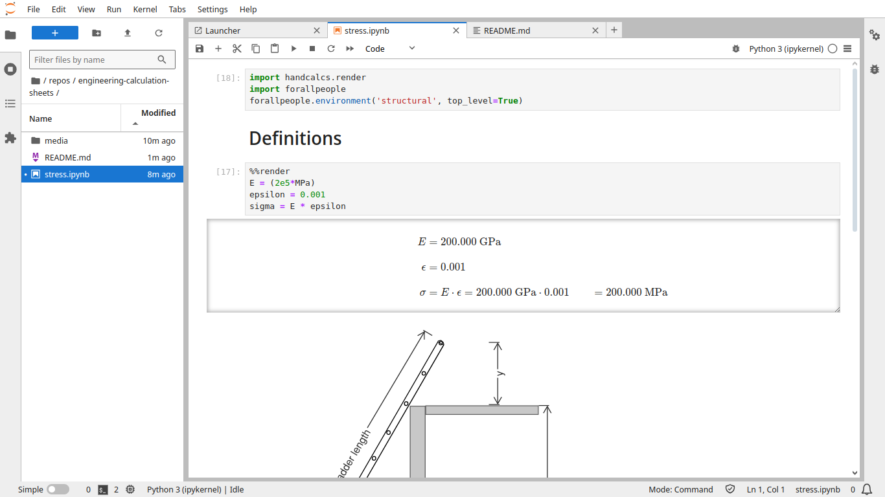

# Engineering calculation sheets

## Run

Install requirements and run:

```bash
pip install jupyterlab
pip install handcalcs
pip install forallpeople
jupyter lab # Create *.ipynb files and enjoy.
```

## About

Take a look at these:

https://youtu.be/n9Uzy3Eb-XI

https://github.com/connorferster/handcalcs

It's a combination of multiple technologies like Jupyter, Python, Markdown, Math Latex, and PIP packages.

It could be a replacement for civil engineering calculation sheets, for example.

## Example

This is an example notebook:


